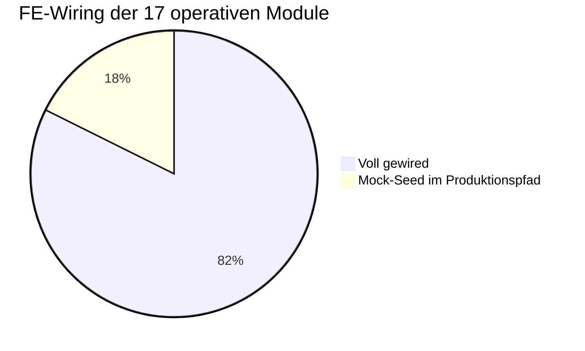
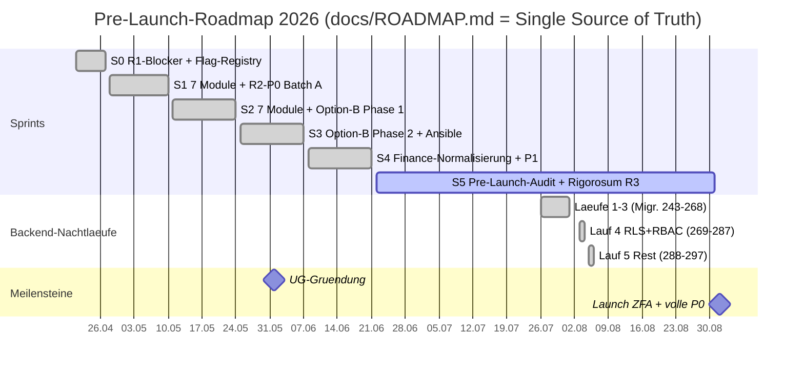

# Projekt-Status-Snapshot — Cosmi/Zentria CRM (Stand: 2026-08-06)

> Deskriptiver Ist-Stand. **Keine** Empfehlungen, keine Priorisierung — reine Lagebeschreibung.
> Jede Zahl hier ist am 2026-08-06 selbst gemessen, nicht aus Doku übernommen. Wo eine Zahl eine
> Näherung ist, steht es dabei. Die vorherige Fassung (2026-06-18) behauptete Migrationskopf 213
> und „Sprint 4 läuft aktiv" — beides war zum Lesezeitpunkt sieben Wochen alt. Wer diese Datei
> künftig liest: **erst das Datum prüfen, dann glauben.**

## Executive Summary

Cosmi (Software) der **Zentria UG i.G.** ist ein All-in-One-CRM für DACH-KMUs mit
EU-Datensouveränität. Der Launch steht auf **2026-09-01**, das sind noch **26 Tage**. Sprint 5
(Pre-Launch-Audit + Rigorosum R3) läuft bis 08-31.

Der Backend-Stand ist seit Juni deutlich weiter: fünf **Backend-Nachtläufe** (externer
`claude -p`-Ralph-Loop, 07-26 bis 08-06) haben die Migrationen **243–297** geliefert — Feature-Nachzug
quer durch die Module, die RLS-Welle (`knownRLSGaps` ist seither **leer**), RBAC Phase 1 mit
tenant-eigenen Rollen und per-User-Overrides, dazu rund 110 neue REST-Pfade. Alle fünf Läufe sind
gemergt und deployt; **Prod-Kopf = Repo-Kopf 297 clean**, 30 von 35 Containern healthy.

Der Engpass hat sich verschoben. Er liegt nicht mehr im FE↔Backend-Wiring — das ist im Wesentlichen
durch —, sondern in **Test-Coverage auf den kritischen Pfaden** (`biz` 48 %, `crm` 51 % gegen ein
Ziel von 60 %) und in einer Handvoll konkreter Restposten, die unten stehen. Der einzige echte
Launch-Blocker bleibt **Legal (AVV/DPA)**, gekoppelt an die UG-Gründung.

---

## 1 · Gemessene Kennzahlen

| Bereich | Wert | Messung |
|---|---|---|
| Services | **24** (23 µSvc + Gateway) | `ls backend/cmd/` |
| Go-Dateien | 1.495, davon **503 Test-Dateien** | `find backend -name "*.go"` |
| gRPC-RPCs | **1.134** über 32 `.proto` | `grep -cE "^\s*rpc\s+"` |
| REST | **821 OpenAPI-Pfade** / 1.171 Operationen | awk über `paths:` in `openapi.yaml` |
| Route-Dateien | 127 `route_*.go` | |
| Migrationen | Kopf **297**, 266 `.up.sql` | Lücken durch Reverts/Renumber |
| **Prod-Migrationskopf** | **297, `dirty=false`** | `psql -U kmuhub -d kmuhub` über SSH |
| Prod-Container | 35 laufend, **30 healthy** | `docker ps` |
| Test-Coverage | **30,2 %** gesamt (Gate 15 %) | CI-Lauf 31087657967 |
| Feature-Flags | **17** (14 `modules.*` + 3 `plugins.*`) | Registry |
| RLS-Lücken | **0** (`knownRLSGaps` leer) | `testutil/rls_regression_test.go:33` |
| Frontend | **34 Module** (32 im Router), 81 API-Hooks, 1.231 TS/TSX | |
| i18n | **12.044 Keys**, de/en voll, fr/it je 34 offen | node-Diff, BOM-safe |
| Loop-Backlog | 34 done · 7 blocked · 2 todo | `backend-block/loop/BACKLOG.yml` |

---

## 2 · Modul-Reifegrad-Matrix

**Legende:** ✅ voll · 🟡 teilweise · ⬜ Stub/offen. „Live-Flag" = Registry-Default; alle 14
Modul-Flags stehen default **OFF**, crm/dialer sind ungegatete Kern-Domänen.

**FE-Wiring ist diesmal echt gemessen**, nicht geschätzt: pro Modul wurde getrennt, ob ein Store als
`import type` (harmlos) oder als Wert importiert wird, und ob dessen Initial-State `MOCK_`/`INITIAL_`-
Konstanten trägt. Der oft zitierte Rohzähler „223 Dateien importieren einen Store" ist als Signal
wertlos — 47 der 96 Stores sind `*Prefs`/`*Tenant`/`*Settings`, also legitimer UI-State.

| Modul | Sprint | Backend-RPCs | FE-Wiring | Live-Flag | Pilot-Prio |
|---|---|:---:|:---:|---|---|
| crm | Kern | ✅ 79 | ✅ | Kern (ungated) | Cross |
| dialer | Kern | ✅ 27 | ✅ | Kern (ungated) | Cross |
| wiki | S1 | ✅ 20 | ✅ | `modules.wiki` OFF | Dienstleister |
| berichte | S1 | ✅ 26 | ✅ | `modules.berichte` OFF | Dienstleister |
| formulare | S1 | ✅ 22 | ✅ | `modules.formulare` OFF | Cross |
| helpdesk | S1 | ✅ 38 | 🟡 **Mock-Seed** | `modules.helpdesk` OFF | Dienstleister |
| vertraege | S1 | ✅ 15 | 🟡 **Mock-Seed** | `modules.vertraege` OFF | Dienstleister |
| buchhaltung/finanzen | S1+S4 | ✅ 121 (`biz`) | ✅ | `modules.buchhaltung` OFF | Cross |
| video / meetings | S1 | ✅ 53 | ✅ (`DEMO_MODE`-gated) | `modules.video` OFF | Cross |
| rapporte | S2 | ✅ 34 | ✅ | `modules.rapporte` OFF | Handwerk |
| schichten | S2 | ✅ 20 | ✅ | `modules.schichten` OFF | Handwerk |
| fuhrpark | S2 | ✅ 36 | ✅ | `modules.fuhrpark` OFF | Handwerk |
| vermietung | S2 | ✅ 20 | ✅ | `modules.vermietung` OFF | Handwerk |
| inventar | S2 | ✅ 31 | ✅ | `modules.inventar` OFF | Cross |
| einkauf | S2 | ✅ 36 | ✅ | `modules.einkauf` OFF | Cross |
| produktion | S2 | ✅ 33 | ✅ | `modules.produktion` OFF | Handwerk |
| hr / zeiterfassung | — | ✅ 56 | 🟡 **Mock-Seed** (`timetracking`) | — | Cross |

*Caption: Gegenüber dem Juni-Snapshot (7 voll / 9 teilweise / 1 Stub) hat sich das Bild gedreht — die
Wiring-Wellen und die Nachtläufe haben 14 der 17 Module vollständig verdrahtet. Übrig bleiben drei
Stores mit hartkodiertem Seed, siehe §4.*

---

## 3 · Roadmap

*Caption: Sprint 0–4 abgeschlossen, **Sprint 5 läuft** (heute 2026-08-06, noch 26 Tage bis Launch).
Die fünf Backend-Nachtläufe liefen parallel zu S5 und sind alle gemergt und deployt.*

---

## 4 · Offene Posten

Sortiert nach Nähe zum Nutzer, nicht nach Aufwand.

1. **CSAT ist auf Produktion funktionsunfähig.** `SYSTEM_SMTP_*` steht in `.env.production`, wird im
   Compose aber nur an `auth`/`biz`/`berichte` durchgereicht — **nicht an `helpdesk`**. Der
   CSAT-Dispatcher startet damit nie. Zweitens zeigt der Umfrage-Link auf `app.zentria.tech/csat`,
   wo nichts liegt: Caddy proxyt die Domain vollständig auf den Gateway, ein statisches Frontend
   existiert nicht. Der Default steht seit Lauf 5 bewusst auf **Opt-in**. Zum Scharfschalten fehlen
   beide Teile: Passthrough **und** öffentliche Seite.
2. **Drei Stores mit ungegatetem Mock-Seed**, alle mit `persist` — die Fake-Daten landen also im
   localStorage des Nutzers:
   - `stores/helpdesk.ts:479-487` — `MOCK_TICKETS`, threads, kbArticles, stats, cannedResponses,
     routingRules, businessHours, holidays (Flag `modules.helpdesk` OFF)
   - `stores/vertraege.ts:505-506` — `MOCK_CONTRACTS`, `MOCK_TEMPLATES` (Flag `modules.vertraege` OFF)
   - `stores/timetracking.ts:290` — `INITIAL_ENTRIES` (+ Kategorien, Locations) — **kein Flag**,
     hängt an `team`/`zeiterfassung` und ist damit der einzige, den ein Nutzer wirklich erreicht
3. **Coverage kritischer Pfade unter Ziel.** `biz` (Payments/Finance) 48 %, `crm` (Data) 51 % gegen
   das 60-%-Ziel. `auth` (71 %) und `security` (67 %) erfüllen es. Größter Hebel sind `server` (8 %,
   1.687 Funktionen) und `gateway` (27 %, 1.538 Funktionen) — per „thin handlers" liegt dort wenig
   Logik, aber 8 % ist auch für dünne Wrapper wenig.
4. **`scans.yml` auf main rot.** Rot macht ihn `npm-audit` ohne `continue-on-error`; der Fund ist
   **react-router**, also Frontend. Die Go-CVEs laufen unter `trivy` mit `continue-on-error` —
   Go-Bumps machen den Workflow deshalb **nicht** grün.
5. **MinIO-Backup schlägt beim Deploy fehl** (als `non-critical` geführt, der DB-Dump läuft). Die
   Datei-Ablage hat damit faktisch kein Backup.
6. **i18n:** fr und it fehlen je 34 Keys (Dashboard-Modulkacheln). Alle vier JSON-Dateien tragen ein
   UTF-8-BOM — Signatur von PowerShell `Set-Content`; jedes Skript, das sie direkt parst, muss es
   abfangen.
7. **Legal (AVV/DPA)** — an die UG-Gründung gekoppelt. Einziger echter Launch-Blocker.
8. **Loop-Backlog:** 7 `blocked`, 2 `todo`. „Blocked" heißt hier meist, dass die Prämisse der Unit
   widerlegt wurde (die Route existierte schon), nicht dass der Loop gescheitert wäre.

---

## 5 · Architektur-Überblick

*Caption: Thin-Client → Go-API-Gateway mit vorgelagertem Feature-Flag- und Consent-Layer → 23
gRPC-Microservices → PostgreSQL 16 als einzige Source-of-Truth (Redis nur Cache, kein Dual-Write).
Video/Audio über self-hosted LiveKit + coturn (EU). Das WASM-Plugin-System ist deaktiviert
(`plugins.wasm` OFF + Build-Tag `no_wasm`) — gestrichelte Kante.*

---

## 6 · Deployment-Lage

Produktion läuft auf Hetzner CPX42 (8 vCPU, 16 GB, Nürnberg), `app.zentria.tech`, CD über einen
self-hosted Runner (0 GitHub-Minuten pro Deploy).

⚠ **Der Lauf-5-Deploy am 06.08. riss Produktion 31 Minuten in 503** — der dritte Vorfall desselben
Musters. Auslöser war ein veralteter API-Contract im Smoke-Skript (`role_name` statt `roleId`);
dessen Fehlschlag zog den Auto-Rollback, der per `git checkout <sha>` in einen **detached HEAD**
läuft und diesmal zusätzlich den Code zurücksetzte, während das Schema auf 297 stehen blieb. Zwei
Fixes sind seither drin: `f3c53e7d` (Smoke-Contract) und `e445a1fc` (`deploy.sh` rollt nicht mehr
zurück, sobald Migrationen angewendet wurden). Recovery bei detached HEAD bleibt
`git checkout main && git merge --ff-only`.

---

## Verwandte Dokumente

- `docs/ROADMAP.md` — Single Source of Truth für die Planung
- `docs/MODULES_SCOPE_MATRIX.md` — geplanter Scope je Modul (Tabellen/RPCs/Flags)
- `.knowledge/_index.md` — technischer Wissens-Vault (Architektur, DB, Security, Testing)
- `.planning/MASTER-PLAN.md` — operative Abarbeitung (löst `MASTER-TRACKER.md` ab)
- `.planning/backend-block/loop/` — Nachtloop: Backlog, Journal, Gate-Kommandos
