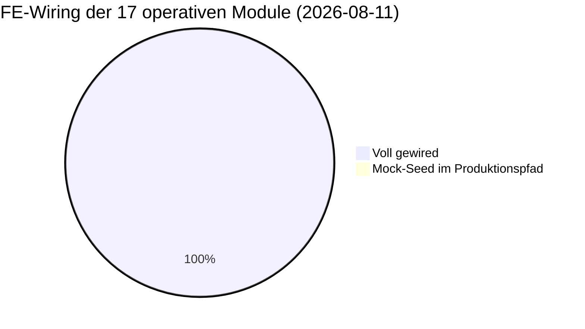
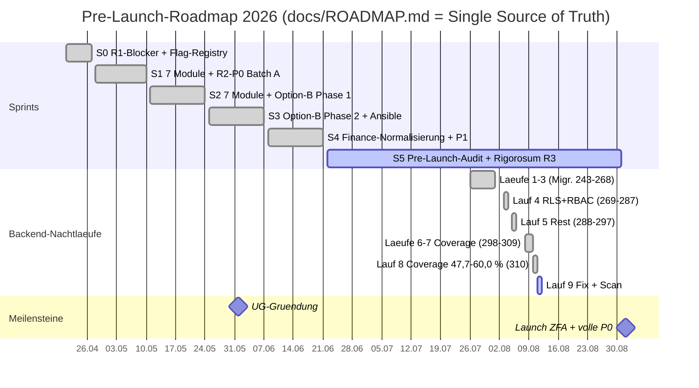
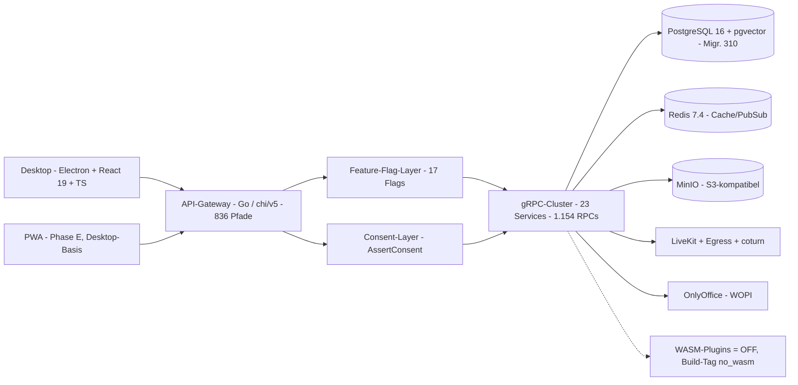

# Projekt-Status-Snapshot — Cosmi/Zentria CRM (Stand: 2026-08-11)

> Deskriptiver Ist-Stand. **Keine** Empfehlungen, keine Priorisierung — reine Lagebeschreibung.
> Jede Zahl hier ist am 2026-08-11 selbst gemessen, nicht aus Doku übernommen — auch nicht aus
> `MEMORY.md` oder `.knowledge/`, die am selben Tag nachgezogen wurden und damit keine unabhängige
> Quelle sind. Wo eine Zahl eine Näherung ist, steht es dabei. Die vorherige Fassung (2026-08-06)
> behauptete Migrationskopf 297, Coverage 30,2 % und einen leeren Loop-Backlog — nach fünf Tagen
> war jeder dieser Punkte überholt. Wer diese Datei künftig liest: **erst das Datum prüfen, dann
> glauben.**

## Executive Summary

Cosmi (Software) der **Zentria UG i.G.** ist ein All-in-One-CRM für DACH-KMUs mit
EU-Datensouveränität. Der Launch steht auf **2026-09-01**, das sind noch **21 Tage**. Sprint 5
(Pre-Launch-Audit + Rigorosum R3) läuft bis 08-31.

**Der im Juli/August dominierende Engpass — Test-Coverage auf den kritischen Pfaden — ist
geschlossen.** Backend-Nachtlauf 8 (10.–11.08., 93 Units, 0 Fehler-Iterationen) hat die Coverage von
47,7 auf **60,0 %** gehoben; die beiden namentlich als Risiko geführten Pakete liegen jetzt über dem
60-%-Ziel (`biz` 48 → **70,6 %**, `crm` 51 → **71,7 %**). Migrationen stehen auf **310**, Prod-Kopf
identisch und clean.

Wichtiger als die Prozentzahl ist, was der Lauf dabei zutage gefördert hat: **zehn verifizierte
Produktionsbugs**, und zwar ausgerechnet in den Paketen mit der *höchsten* Coverage —
`notification/preference` 87,2 % (Quiet Hours schlagen bei jedem Aufruf fehl), `document/virtual`
83,1 % (vier Queries auf eine gelöschte Spalte), `schichten` 79,7 % (Schichttausch ohne
funktionierenden Pfad), `biz/datev` 79,3 % (Upload seit ~zwei Monaten stiller Totalausfall). Der
Engpass ist damit nicht mehr Abdeckung, sondern **Korrektheit**. Nachtlauf 9 (seit 11.08. 16:00)
arbeitet diese zehn Bugs ab und scannt anschließend repo-weit nach denselben vier Fehlermustern.

Der einzige echte Launch-Blocker bleibt **Legal (AVV/DPA)**, gekoppelt an die UG-Gründung.

---

## 1 · Gemessene Kennzahlen

| Bereich | Wert | Δ zum 06.08. | Messung |
|---|---|---|---|
| Services | **24** (23 µSvc + Gateway) | — | `ls backend/cmd/` |
| Go-Dateien | 1.709, davon **711 Test-Dateien** | +214 / +208 | `find backend -name "*.go"` |
| gRPC-RPCs | **1.154** über 32 `.proto` | +20 | `grep -cE "^\s*rpc\s+"` |
| REST | **836 OpenAPI-Pfade** / 1.192 Operationen | +15 / +21 | `grep -cE "^  /"` in `openapi.yaml` |
| Route-Dateien | 87 Quell-`route_*.go` (+71 Testdateien) | Zählmethode korrigiert¹ | `ls internal/gateway/` |
| Migrationen | Kopf **310**, 279 `.up.sql` | +13 / +13 | Lücken durch Reverts/Renumber |
| **Prod-Migrationskopf** | **310, `dirty=false`** | +13 | `psql -U kmuhub -d kmuhub` über SSH |
| Prod-Container | 36 laufend, **30 healthy, 0 unhealthy** | +1 / — | `docker ps` |
| Test-Coverage | **60,0 %** gesamt (Gate 15 %) | **+29,8 pp** | CI-Lauf 31471247645 |
| Feature-Flags | **17** (16 default OFF, 1 ON) | — | Registry |
| RLS-Lücken | **0** (`knownRLSGaps` leer) | — | `testutil/rls_regression_test.go` |
| Frontend | **34 Module**, 81 API-Hook-Dateien (993 Hooks), 1.234 TS/TSX | +3 TS/TSX | |
| i18n | **12.072 Keys × 4 Sprachen, Parität vollständig** | fr/it +34, BOM weg | `locale-parity.test.ts` |
| Loop-Backlog | **21 todo** (10 Fix + 11 Scan), 0 blocked | war 0 todo | `backend-block/loop/BACKLOG.yml` |

¹ Die alte Zahl „127 `route_*.go`" zählte Testdateien mit. Getrennt sind es **87 Quelldateien**,
davon **29 ohne eigene Testdatei** — die größten `route_email.go` (1.612 LOC) und
`route_settings.go` (1.029 LOC).

### Coverage nach Paket (CI-Lauf 31471247645, gesamt 60,0 %)

| Paket | Coverage | | Paket | Coverage |
|---|---:|---|---|---:|
| `internal/schichten` | 79,7 % | | `internal/document` | 71,9 % |
| `internal/chat` | 79,7 % | | `internal/inventar` | 72,9 % |
| `internal/security` | 79,5 % | | `internal/crm` | **71,7 %** |
| `internal/produktion` | 77,8 % | | `internal/biz` | **70,6 %** |
| `internal/rapporte` | 76,0 % | | `internal/notification` | 68,8 % |
| `internal/auth` | 67,9 % | | `internal/dialer` | 65,9 % |
| `internal/einkauf` | 63,9 % | | `internal/inbox` | 60,7 % |
| `internal/email` | 59,7 % | | `internal/work` | 50,3 % |
| `internal/fuhrpark` | 54,5 % | | `internal/caldav` | 54,2 % |
| `internal/wiki` / `formulare` | 53,5 % | | `internal/vermietung` | 48,2 % |
| **`internal/gateway`** | **46,0 %** | | `internal/database` | 44,3 % |
| `internal/testutil` | 15,6 % | | `internal/idempotency` | **0,0 %** |

`internal/gateway` ist damit das schwächste Kernpaket. `internal/idempotency` mit 0,0 % ist der
einzige Nullwert außerhalb von `cmd/*` (dort ist 0 % erwartbar — reine `main`-Verdrahtung).

---

## 2 · Modul-Reifegrad-Matrix

**Legende:** ✅ voll · 🟡 teilweise · ⬜ Stub/offen. „Live-Flag" = Registry-Default; 16 der 17 Flags
stehen default **OFF**, crm/dialer sind ungegatete Kern-Domänen.

**Alle drei Mock-Seed-Markierungen aus der Vorfassung sind am 2026-08-11 geschlossen** (Commit
`3353a402`, siehe §4). Zusätzlich zu den drei dort genannten Stores war `team.ts` betroffen —
ungegatet wie `timetracking` und mit erfundenen Gehaltsdaten.

| Modul | Sprint | Backend-RPCs | FE-Wiring | Live-Flag | Pilot-Prio |
|---|---|:---:|:---:|---|---|
| crm | Kern | ✅ 81 | ✅ | Kern (ungated) | Cross |
| dialer | Kern | ✅ 27 | ✅ | Kern (ungated) | Cross |
| wiki | S1 | ✅ 20 | ✅ | `modules.wiki` OFF | Dienstleister |
| berichte | S1 | ✅ 26 | ✅ | `modules.berichte` OFF | Dienstleister |
| formulare | S1 | ✅ 22 | ✅ | `modules.formulare` OFF | Cross |
| helpdesk | S1 | ✅ 38 | ✅ (`DEMO_MODE`-gated) | `modules.helpdesk` OFF | Dienstleister |
| vertraege | S1 | ✅ 15 | ✅ (`DEMO_MODE`-gated) | `modules.vertraege` OFF | Dienstleister |
| buchhaltung/finanzen | S1+S4 | ✅ 121 (`biz`) | ✅ | `modules.buchhaltung` OFF | Cross |
| video / meetings | S1 | ✅ 54 | ✅ (`DEMO_MODE`-gated) | `modules.video` OFF | Cross |
| rapporte | S2 | ✅ 34 | ✅ | `modules.rapporte` OFF | Handwerk |
| schichten | S2 | ✅ 20 | ✅ | `modules.schichten` OFF | Handwerk |
| fuhrpark | S2 | ✅ 41 | ✅ | `modules.fuhrpark` OFF | Handwerk |
| vermietung | S2 | ✅ 20 | ✅ | `modules.vermietung` OFF | Handwerk |
| inventar | S2 | ✅ 39 | ✅ | `modules.inventar` OFF | Cross |
| einkauf | S2 | ✅ 36 | ✅ | `modules.einkauf` OFF | Cross |
| produktion | S2 | ✅ 34 | ✅ | `modules.produktion` OFF | Handwerk |
| hr / zeiterfassung | — | ✅ 56 | ✅ (`DEMO_MODE`-gated) | — (**ungegatet**) | Cross |

*Caption: Die drei Mock-Seed-Stores der Vorfassung sind geschlossen, ein vierter (`team`) kam bei
der Prüfung dazu und ist mit erledigt. Alle 17 operativen Module sind damit ohne hartkodierten Seed
im Produktionspfad. `hr/zeiterfassung` bleibt das einzige Modul ohne Feature-Flag — es ist über
`team`/`zeiterfassung` für jeden Nutzer mit Standard-Capability erreichbar.*

---

## 3 · Roadmap

*Caption: Sprint 0–4 abgeschlossen, **Sprint 5 läuft** (heute 2026-08-11, noch 21 Tage bis Launch).
Die Nachtläufe 1–8 sind gemergt und deployt; Lauf 9 läuft seit dem 11.08. 16:00 als reiner Fix- und
Scan-Lauf ohne Coverage-Units.*

---

## 4 · Offene Posten

Sortiert nach Nähe zum Nutzer, nicht nach Aufwand. **Vier Posten der Vorfassung sind am 2026-08-11
geschlossen** und stehen zur Nachvollziehbarkeit unter §4b.

1. **Zehn verifizierte Produktionsbugs, in Arbeit (Nachtlauf 9).** Alle gegen die lokale DB
   reproduziert und mit einem Pin-Test festgenagelt, der das *kaputte* Ist-Verhalten assertiert.
   Nutzersichtbar bzw. Compliance-relevant:
   - `security/audit` — rohes INET in einen Go-`string` gescannt: Audit-Viewer, CSV/JSON-Export und
     die `VerifyAuditChain`-RPC sind für **jeden Tenant mit realer Aktivität** tot (Art.-30-Nachweis)
   - `biz/datev` — INSERT ohne `tenant_id`: DATEV-Upload seit `COSMI_ENV=production` (05.06.)
     stiller Totalausfall, ~zwei Monate unbemerkt
   - `schichten` — Schichttausch hat **keinen** funktionierenden Pfad (Unique-Violation oder
     stiller No-Op mit `approved`)
   - `notification/preference` — `ON CONFLICT` auf einen nicht existierenden Index, Quiet Hours
     lassen sich gar nicht anlegen (SQLSTATE 42P10)
   - `document/virtual` — 4 Queries auf die seit Migration 000001 gelöschte Spalte `display_name`
   - dazu `security/gdpr` (Doppelzählung im Art.-17-Löschnachweis), `server`/`email` (leere
     Anhang-Metadaten, Null-UUID-Tenant), `rapporte` (500 statt leerer Vorlage), `server`/`crm`
     (JSON `null` statt `[]`)
2. **`internal/gateway` bei 46,0 %** — schwächstes Kernpaket, 29 von 87 Quelldateien ohne eigene
   Testdatei. Als Trust-Boundary (Auth, RBAC, Input-Validierung) gewichtiger als der Prozentwert
   allein nahelegt. Bewusst **nicht** Teil von Lauf 9.
3. **118 TypeScript-Fehler im Desktop** (`tsc -p tsconfig.web.json --noEmit`). Der Großteil liegt in
   `__tests__`, aber auch Produktionscode ist betroffen: `ReactionBar.tsx` (`.length`/`.map` auf
   `ListReactionsApiResponse` — Signatur des bekannten Nested-Proto-vs-flacher-Typ-Musters),
   `useProjects.ts`, `finance-client.ts`, `BackgroundSelector.tsx`. Vorbestand, nicht neu; erklärt,
   warum ein Full-`tsc` hier kein brauchbares Gate ist.
4. **Electron 33.4.11 mit 34 High-Advisories.** npm führt `electron` als devDependency, es wird aber
   in die App gebündelt und ist damit **Nutzer-Laufzeit** — `npm audit --omit=dev`, das `scans.yml`
   ausführt, blendet genau diese Fläche aus. Der von npm vorgeschlagene Fix ist 43.3.0, also zehn
   Major-Versionen; der Advisory-Range endet bei `<=39.8.9`, ein Sprung auf 39.8.10+ könnte also
   reichen. Ungeprüft, braucht eine Entscheidung vor Launch. Gleiches Muster bei `sharp` und
   `vitest`/`vite`, beide aber echt dev-only.
5. **`PASSWORD_RESET_BASE_URL`-Nachlauf.** Die Seite existiert seit `10a1a26e`, aber der
   End-to-End-Durchlauf (Mail anfordern → Link klicken → Passwort setzen → Login) ist auf Produktion
   noch nicht gegen einen echten Mailversand geprüft.
6. **CSAT bleibt stillgelegt.** Verifiziert dicht: die Public-Route `POST
   /api/v1/public/helpdesk/csat/{token}` ist zwar ungegatet registriert, liefert aber konstant 404,
   weil nie ein Token ausgestellt wird; `GetCsatConfig`/`UpdateCsatConfig` existieren als RPC, haben
   aber keine Gateway-Route; Default `Enabled: false`. Gebündelt mit den sieben Public-Token-Routen
   und der nie gebauten `guest-chat`-SPA zum Projekt „Public Web Surface" in `BACKLOG-PARKED.yml`.
7. **Legal (AVV/DPA)** — an die UG-Gründung gekoppelt. Einziger echter Launch-Blocker.

### 4b · Am 2026-08-11 geschlossen

- **Mock-Seed in Zustand-Stores** (`3353a402`) — `timetracking` und `team` waren über keinen
  Feature-Flag gegatet und damit für jeden Nutzer erreichbar; `team` seedete erfundene
  Gehaltsabrechnungen mit Namen, Bruttobeträgen und AHV/Steuer-Aufschlüsselung in den localStorage.
  Alle vier Stores (plus `helpdesk`, `vertraege`) laufen jetzt über `DEMO_MODE`, mit `migrate()` für
  Bestandsinstallationen.
- **`scans.yml` wieder grün** (`a72a987a`) — react-router 7.17.0 → 7.18.2 (fünf High-Advisories,
  u. a. Open Redirect und RSC-XSS) und dompurify 3.4.12 → 3.4.13. Beides Produktions-Dependencies
  und innerhalb des Caret-Bereichs. `npm audit --audit-level=high --omit=dev` — der exakte
  CI-Befehl — meldet 0.
- **MinIO-Backup** (`3753a4fc`) — `docker exec minio tar` konnte nie funktionieren, weil das
  offizielle MinIO-Image kein `tar` enthält; jeder Lauf schlug fehl, loggte „non-critical" und
  löschte die leere Datei. Auf Produktion lag entsprechend **kein einziges** `minio_*.tar.gz`.
  Ersetzt durch einen Sidecar auf demselben Volume, mit Größenprüfung gegen ein leeres Archiv.
- **i18n-Parität** (`d4f0c9ec`) — fr und it fehlten je dieselben 34 Keys (Dashboard-Modulkacheln und
  die vier Aufzeichnungs-Consent-Strings, wo ein Rohschlüssel besonders ungünstig steht); alle vier
  Dateien trugen ein UTF-8-BOM. `locale-parity.test.ts` pinnt Parität, Waisen-Keys, leere Werte und
  BOM-Freiheit.

---

## 5 · Architektur-Überblick

*Caption: Thin-Client → Go-API-Gateway mit vorgelagertem Feature-Flag- und Consent-Layer → 23
gRPC-Microservices → PostgreSQL 16 als einzige Source-of-Truth (Redis nur Cache, kein Dual-Write).
Video/Audio über self-hosted LiveKit + coturn (EU). Das WASM-Plugin-System ist deaktiviert
(`plugins.wasm` OFF + Build-Tag `no_wasm`) — gestrichelte Kante. Seit `10a1a26e` liefert das Gateway
zusätzlich eine eingebettete HTML-Seite unter `/reset-password` aus — die einzige nicht-API-Fläche.*

---

## 6 · Deployment-Lage

Produktion läuft auf Hetzner CPX42 (8 vCPU, 16 GB, Nürnberg), `app.zentria.tech`, CD über einen
self-hosted Runner (0 GitHub-Minuten pro Deploy). Ein Merge nach `main` **ist** der Deploy:
`cd.yml` triggert per `workflow_run` auf jeden CI-Erfolg an `main`, ein manuelles Gate gibt es nicht.

`ci.yml` filtert auf `paths: ["backend/**", ".github/workflows/ci.yml"]`. Reine Doku- oder
Frontend-Commits lösen daher weder CI noch CD aus — das erklärt, warum `main` zeitweise Commits
trägt, die Produktion nicht kennt, ohne dass ein funktionaler Drift vorliegt.

⚠ **Der Lauf-5-Deploy am 06.08. riss Produktion 31 Minuten in 503** — der dritte Vorfall desselben
Musters. Auslöser war ein veralteter API-Contract im Smoke-Skript (`role_name` statt `roleId`);
dessen Fehlschlag zog den Auto-Rollback, der per `git checkout <sha>` in einen **detached HEAD**
läuft und diesmal zusätzlich den Code zurücksetzte, während das Schema auf 297 stehen blieb. Zwei
Fixes sind seither drin: `f3c53e7d` (Smoke-Contract) und `e445a1fc` (`deploy.sh` rollt nicht mehr
zurück, sobald Migrationen angewendet wurden). Recovery bei detached HEAD bleibt
`git checkout main && git merge --ff-only`. Seither zwei Deploys ohne Vorfall (08-10, 08-11).

---

## Verwandte Dokumente

- `docs/ROADMAP.md` — Single Source of Truth für die Planung
- `docs/MODULES_SCOPE_MATRIX.md` — geplanter Scope je Modul (Tabellen/RPCs/Flags)
- `.knowledge/_index.md` — technischer Wissens-Vault (Architektur, DB, Security, Testing)
- `.planning/MASTER-PLAN.md` — operative Abarbeitung (löst `MASTER-TRACKER.md` ab)
- `.planning/backend-block/loop/` — Nachtloop: Backlog, Journal, Gate-Kommandos
