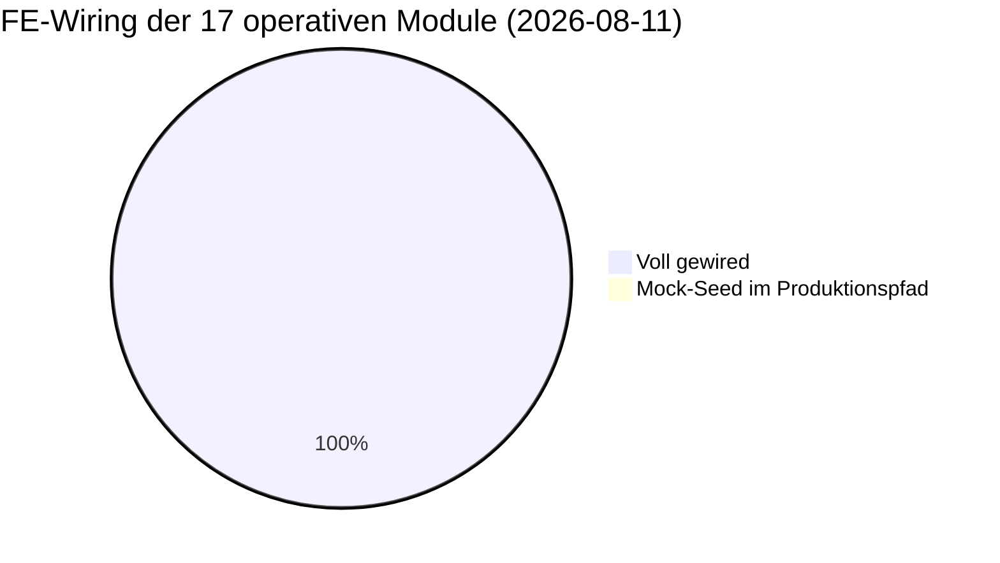
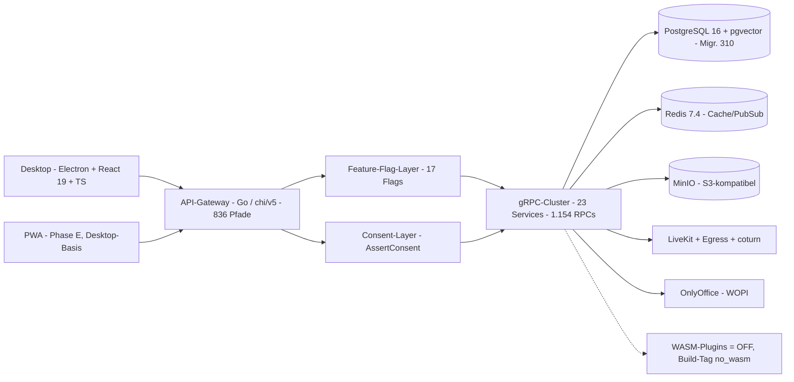

# Projekt-Status-Snapshot — Cosmi/Zentria CRM (Stand: 2026-08-26)

> Deskriptiver Ist-Stand. **Keine** Empfehlungen, keine Priorisierung — reine Lagebeschreibung.
> Die Zahlen in §1 sind am 2026-08-26 nach dem Merge von Nachtlauf 12 (`1a6cc473`) neu gemessen —
> Coverage aus dem Artefakt von CI-Lauf 32949396303, alles Übrige per Grep und SSH gegen den
> deployten Stand — nicht aus Doku übernommen, auch nicht aus `MEMORY.md` oder `.knowledge/`, die
> derselben Messung nachgezogen werden und damit keine unabhängige Quelle sind. Abschnitte
> außerhalb von §1 tragen weiterhin ihr eigenes Datum (§2–§5: 2026-08-22). Wo eine Zahl eine
> Näherung ist, steht es dabei. Die vorherige Fassung (2026-08-06)
> behauptete Migrationskopf 297, Coverage 30,2 % und einen leeren Loop-Backlog — nach fünf Tagen
> war jeder dieser Punkte überholt. Wer diese Datei künftig liest: **erst das Datum prüfen, dann
> glauben.**
>
> **Prämissenwechsel am 2026-08-12:** Diese Fassung ist die erste nach dem Lagebild
> (`launch-lagebild-2026-08-12.md`). Entwertet sind das Launch-Datum 2026-09-01, der Sprint-Kalender,
> der ZFA-Pilot und die Aussage „Legal ist der einzige Blocker". Die *gemessenen* Zahlen aus §1 und §2
> sind davon unberührt und weiter gültig — geändert hat sich, wogegen sie gemessen werden.

## Executive Summary

Cosmi (Software) ist ein All-in-One-CRM für DACH-KMUs mit EU-Datensouveränität. Rechtsträger ist
bislang **keine UG** — die Gründung steht aus.

**Das Launch-Datum 2026-09-01 ist seit 2026-08-12 entwertet** (Lagebild
`.planning/launch-lagebild-2026-08-12.md`). An seine Stelle tritt ein **Produkt 1.0.0** nach
Reifegrad-Gates: zeigbar, nutzbar, ohne Fremdscham. Die fünf prüfbaren Kriterien (Lagebild §3) stehen
heute so: **① nichts öffentlich Gesagtes ist in 30 Sekunden widerlegbar — nein · ② ein Fremder kann
das Produkt selbst starten — nein · ③ die drei Kernflüsse halten gegen das echte Backend — nein ·
④ kein Bildschirm zeigt Rohschlüssel oder Erfolg ohne Wirkung — fast · ⑤ ein Ausfall ist überlebbar
— nein.** Es gibt keinen Sprint-Kalender mehr; Etappe N+1 beginnt, wenn N belegt abgeschlossen ist.

**Der im Juli/August dominierende Engpass — Test-Coverage auf den kritischen Pfaden — ist
geschlossen.** Backend-Nachtlauf 8 (10.–11.08., 93 Units, 0 Fehler-Iterationen) hat die Coverage von
47,7 auf **60,0 %** gehoben; die beiden namentlich als Risiko geführten Pakete liegen jetzt über dem
60-%-Ziel (`biz` 48 → **70,6 %**, `crm` 51 → **71,7 %**).

Wichtiger als die Prozentzahl ist, was der Lauf dabei zutage gefördert hat: **zehn verifizierte
Produktionsbugs**, und zwar ausgerechnet in den Paketen mit der *höchsten* Coverage —
`notification/preference` 87,2 % (Quiet Hours schlagen bei jedem Aufruf fehl), `document/virtual`
83,1 % (vier Queries auf eine gelöschte Spalte), `schichten` 79,7 % (Schichttausch ohne
funktionierenden Pfad), `biz/datev` 79,3 % (Upload seit ~zwei Monaten stiller Totalausfall). Der
Engpass ist damit nicht mehr Abdeckung, sondern **Korrektheit**.

**Nachtlauf 9 (11.08., 16:20–20:23) hat genau das abgearbeitet und ist gemergt** (`60dcdae1`).
37 Iterationen, 37 `done`, 0 `blocked`, 0 Fehler-Iterationen, **keine** Coverage-Unit. Alle zehn
Bugs sind gefixt; die elf Muster-Scans haben sich selbst nachgefüllt und **16 weitere Fix-Units**
erzeugt, die derselbe Lauf mit abgearbeitet hat (21 Start-Units → 37). Die neun Pin-Tests, die das
kaputte Verhalten festgenagelt hatten, sind allesamt **umgedreht statt gelöscht** — sie behaupten
jetzt das korrekte Verhalten. Migrationen stehen dadurch auf **313** (311 `DEFERRABLE`-Unique für
den Schichttausch, 312+313 Tenant-Verbreiterung dreier Notification-Unique-Indexe).

**Nachtlauf 10 (22.08., 00:18–12:43) ist gemergt** (`f87ffdcf`) **und deployt.** 92 Iterationen,
91 `done`, 2 `blocked` (beides Rechercheergebnisse: DATEV-Kodierung ohne zitierbare Primärquelle,
Buchungsseiten-Erasure als Produktentscheidung — inzwischen entschieden: deaktivieren). Der Lauf hat
die **DSGVO-Mechanik aus Gate 3** gebaut: die Auskunft kennt zwölf Datenbereiche mehr, acht
Erasure-Handler sind korrigiert oder neu und **alle doppellauf-fest**, und die seit Migration 000233
existierenden `retention_policies` werden zum ersten Mal von einer Engine ausgeführt — im auth-Service,
Default `dry_run`, erster Produktionslauf am 22.08. 11:52 UTC bestätigt. Dazu Gateway-Härtung
(Fehler-Leakage in drei Integrationsrouten, CSV-Formel-Injection in sechs Exporten, fünf Delete-Pfade,
die mit `foreign_key_violation` abstürzten) und 21 Routen-Testsuiten. Coverage 60,0 → **62,7 %**,
`internal/gateway` 46,1 → **54,1 %**. Migrationen **314 → 322**.

**Nachtlauf 11 (24.08.) ist gemergt** (`acc48aee`) **und deployt** — 121 Units, roter Faden
Geld- und Compliance-Pfade: `payment` 46,4 → 85,3 %, `dunning` 61,8 → 92,2 %, `invoice`
34,8 → 61,1 %. Coverage gesamt 62,7 → **64,1 %**, Migrationen **322 → 323**.

**Nachtlauf 12 (25./26.08., bis 07:31) ist gemergt** (`1a6cc473`) **und deployt.** 43 Iterationen,
41 `done`, **0 `blocked`**, 95 Commits, Ø 10,4 min je Iteration. Roter Faden waren die
**Nicht-Geld-Module end-to-end** — genau die Flächen, die Lauf 11 ausgelassen hatte. Coverage
64,1 → **69,6 %**; die größten Einzelsprünge sind `vermietung` 48,2 → 82,6, `fuhrpark`
54,5 → 81,3, `formulare` 53,6 → 83,2, `work` 50,3 → 72,1 und `idempotency` 0,0 → 87,0.

Der Lauf hat neben 28 Coverage-Units auch Produktionscode geändert (~1.075 Zeilen über 28 Dateien):
vier neue GDPR-Retention-Handler (`vehicle_bookings`, `driver_licenses`, `advisory_protocols`,
`guest_sessions`) samt Registrierung im auth-Service, CalDAV-REST-Routen laufen jetzt durch die
Idempotency-Middleware, die CRM-Deal- und Activity-Tag-Endpunkte sind über gRPC verdrahtet statt
am Service vorbei, PII-Scrubbing für anonymisierte Kontakte (Dialer-Notizen, Inbox-Nachrichten,
Mietidentität), DATEV-OAuth-Refresh per Tenant serialisiert, Käufer-USt-IdNr. auf Rechnungs- und
Gutschrift-PDFs. Migrationen **323 → 325** (beides Indizes auf bestehenden Tabellen: partieller
UNIQUE gegen die Doppel-Konvertierung eines Angebots, Retention-Index auf `guest_sessions`).
**Keine neue Route, kein neuer `RequirePermission`-Guard** — `openapi.yaml` ist unverändert.

**Der Loop-Backlog ist erstmals nicht leer:** 57 `todo` bleiben stehen, weil das Zeitfenster und
nicht die Queue den Lauf beendet hat. Darunter sechs verifizierte, ungefixte Befunde — der
schwerste ist `handlePresenceSubscribe` (`internal/server/websocket.go:1116`), das `user_ids` roh
aus der Client-Nachricht übernimmt; Presence liegt in Redis unter `presence:<userID>` ohne
Tenant-Anteil, wo keine RLS greift. Ein authentifizierter Nutzer kann damit den Online-Status von
Nutzern fremder Tenants abonnieren.

**Das CI-Signal dieses Laufs war der eigentliche Fund.** Der erste Lauf über die 183 Commits war rot:
ein Advisory-Lock-Leak, den der bestehende Idempotency-Cleanup und der *neu gebaute*
Retention-Scheduler teilten — der Lock wurde über den Pool genommen und über den Pool freigegeben,
also auf einer anderen Verbindung, wo das Unlock wirkungslos ist. Beide Worker wären nach dem ersten
Tick dauerhaft eingeschlafen, ohne eine Zeile Fehlerausgabe. Zwei Lehren, die über diesen Fall
hinausgehen: ein DB-Test, der lokal grün ist, weil der Pool nur eine warme Verbindung hatte, beweist
nichts — und wer ein vorhandenes Muster als Vorlage kopiert, kopiert seine Fehler mit. Behoben in
`778a2e44`, in Produktion gegengeprüft (null hängende Advisory Locks).

Was die Scans über den Zustand des Codes sagen, ist mindestens so wertvoll wie die Fixes: Muster A
(ON-CONFLICT-Ziel vs. echter Index) ergab über 41 Klauseln in 29 Dateien **null** Funde, Muster B
(INSERT ohne `tenant_id`) über 26 Zielpakete genau **einen**. Die Fehlerdichte konzentriert sich
also nicht flächig, sondern in wenigen Ecken — vor allem im nil-slice-Wire-Shape (neun Units über
30 `*_grpc.go`-Dateien).

**Legal ist nicht mehr der einzige Blocker** — diese Aussage stand hier bis zum 2026-08-12 und war
falsch. Das Lagebild zählt **13 G0-Befunde ≈ 10 Personentage** zwischen dem heutigen Stand und einem
zeigbaren Produkt (§4a). Die größte Einzelposition sind **3,25 PT Website**: `zentria.tech` verspricht
„Keine US-Cloud, Daten verlassen niemals die EU" und läuft dabei selbst auf Vercel. Legal (AVV/DPA)
ist einer der 13 Posten, gekoppelt an die UG-Gründung, und liegt in Etappe 4.

---

## 1 · Gemessene Kennzahlen

| Bereich | Wert | Δ zum 06.08. | Messung |
|---|---|---|---|
| Services | **24** (23 µSvc + Gateway) | — | `ls backend/cmd/` |
| Go-Dateien | 1.853, davon **838 Test-Dateien** | +79 / +73 | `find backend -name "*.go"` |
| gRPC-RPCs | **1.160** über 32 `.proto` | +4 | `grep -cE "^\s*rpc\s+"` |
| REST | **838 OpenAPI-Pfade** | — | `grep -cE "^  /"` in `openapi.yaml` |
| Route-Dateien | **75 Quell-`route_*.go` + 125 Testdateien** | Testdateien +19¹ | `ls internal/gateway/` |
| Migrationen | Kopf **325**, 294 `.up.sql` | +3 / +3 | Lücken durch Reverts/Renumber |
| **Prod-Migrationskopf** | **325, `dirty=false`** — Repo = Prod | +3 | `psql -U kmuhub -d kmuhub` über SSH |
| Prod-Container | 38 laufend, **32 healthy, 0 unhealthy** | +2 / +2 | `docker ps` |
| Test-Coverage | **69,6 %** gesamt (Gate 15 %) | **+6,9 pp** | CI-Lauf 32949396303 |
| Feature-Flags | **17** (16 default OFF, 1 ON) | — | Registry |
| RLS-Lücken | **0** (`knownRLSGaps` leer) | — | `testutil/rls_regression_test.go` |
| Frontend | **34 Module**, 81 API-Hook-Dateien (993 Hooks), 1.234 TS/TSX | +3 TS/TSX | |
| i18n | **12.072 Keys × 4 Sprachen, Parität vollständig** | fr/it +34, BOM weg | `locale-parity.test.ts` |
| Loop-Backlog | **57 `todo`, 1 `blocked`** (Lauf 12: 41 done) | Queue erstmals nicht leer | `backend-block/loop/BACKLOG.yml` |

¹ 200 `route_*.go` insgesamt, davon 125 Testdateien → **75 Quelldateien**. Die Zuordnung ist nicht
1:1: `route_email.go` hat keine gleichnamige Testdatei, wird aber von sieben `route_email_*_test.go`
abgedeckt. Nach Präfix gemessen bleiben **drei** Quelldateien ohne jede eigene Testdatei —
`route_health.go` (67 LOC), `route_registrar.go` (20) und `route_biz_time_entries.go` (80, im
Nachbartest `route_biz_open_items_test.go` mit abgedeckt). Vor Lauf 10 waren es 29.
Lauf 12 hat 19 weitere Routen-Testsuiten ergänzt, ohne eine einzige neue Route anzulegen.

### Coverage nach Paket (CI-Lauf 32949396303, gesamt 69,6 %)

Statement-gewichtet aus `coverage.out` gerechnet, Rollup je `internal/<Domäne>`. „war" = Stand
CI-Lauf 32735558575 (2026-08-24), also die Ausgangslage von Nachtlauf 12.

| Paket | Coverage | | Paket | Coverage |
|---|---:|---|---|---:|
| `internal/berichte` | 87,3 % | | `internal/crm` | 76,5 % |
| `internal/idempotency` | **87,0 %** (war 0,0) | | `internal/security` | 75,2 % |
| `internal/formulare` | **83,2 %** (war 53,6) | | `internal/inventar` | 73,1 % |
| `internal/vertraege` | 82,6 % | | `internal/work` | **72,1 %** (war 50,3) |
| `internal/vermietung` | **82,6 %** (war 48,2) | | `internal/biz` | 71,7 % |
| `internal/helpdesk` | 81,5 % | | `internal/server` | 71,3 % |
| `internal/fuhrpark` | **81,3 %** (war 54,5) | | **`internal/gateway`** | **69,3 %** (war 56,6) |
| `internal/document` | 81,0 % | | `internal/caldav` | **68,6 %** (war 54,9) |
| `internal/automation` | 80,4 % | | `internal/notification` | 68,2 % |
| `internal/schichten` | 79,4 % | | `internal/auth` | 67,9 % |
| `internal/einkauf` | **79,1 %** (war 63,9) | | `internal/inbox` | 66,8 % |
| `internal/chat` | 78,0 % | | `internal/dialer` | 65,9 % |
| `internal/produktion` | 77,8 % | | `internal/email` | 62,4 % |
| `internal/rapporte` | 76,8 % | | `internal/settings` | 60,3 % |

Schwächste Flächen jetzt: `internal/middleware` 57,7 %, `internal/wiki` 53,5 %,
`internal/plugin` 53,8 % (davon `plugin/wasm` **0,0 %** — Feature-Flag OFF, Build-Tag `no_wasm`),
`internal/database` 44,3 %, `internal/testutil` 7,9 % (Testhilfen, kein Produktionspfad).

Nach **absoluter** Zahl ungedeckter Statements bleibt die Rangfolge unverändert:
`internal/gateway` **7.009** (war 9.882) und `internal/server` **5.877** (war 5.941) sind zusammen
für rund 60 % aller ungedeckten Statements im Backend verantwortlich — der Prozentsprung des
Gateways täuscht darüber hinweg, dass es weiterhin die größte Einzelfläche ist. `internal/server`
hat der Lauf praktisch nicht angefasst.

---

## 2 · Modul-Reifegrad-Matrix

**Legende:** ✅ voll · 🟡 teilweise · ⬜ Stub/offen. „Live-Flag" = Registry-Default; 16 der 17 Flags
stehen default **OFF**, crm/dialer sind ungegatete Kern-Domänen.

**Alle drei Mock-Seed-Markierungen aus der Vorfassung sind am 2026-08-11 geschlossen** (Commit
`3353a402`, siehe §4). Zusätzlich zu den drei dort genannten Stores war `team.ts` betroffen —
ungegatet wie `timetracking` und mit erfundenen Gehaltsdaten.

| Modul | Sprint | Backend-RPCs | FE-Wiring | Live-Flag | Pilot-Prio |
|---|---|:---:|:---:|---|---|
| crm | Kern | ✅ 81 | ✅ | Kern (ungated) | Cross |
| dialer | Kern | ✅ 27 | ✅ | Kern (ungated) | Cross |
| wiki | S1 | ✅ 20 | ✅ | `modules.wiki` OFF | Dienstleister |
| berichte | S1 | ✅ 26 | ✅ | `modules.berichte` OFF | Dienstleister |
| formulare | S1 | ✅ 22 | ✅ | `modules.formulare` OFF | Cross |
| helpdesk | S1 | ✅ 38 | ✅ (`DEMO_MODE`-gated) | `modules.helpdesk` OFF | Dienstleister |
| vertraege | S1 | ✅ 15 | ✅ (`DEMO_MODE`-gated) | `modules.vertraege` OFF | Dienstleister |
| buchhaltung/finanzen | S1+S4 | ✅ 121 (`biz`) | ✅ | `modules.buchhaltung` OFF | Cross |
| video / meetings | S1 | ✅ 54 | ✅ (`DEMO_MODE`-gated) | `modules.video` OFF | Cross |
| rapporte | S2 | ✅ 34 | ✅ | `modules.rapporte` OFF | Handwerk |
| schichten | S2 | ✅ 20 | ✅ | `modules.schichten` OFF | Handwerk |
| fuhrpark | S2 | ✅ 41 | ✅ | `modules.fuhrpark` OFF | Handwerk |
| vermietung | S2 | ✅ 20 | ✅ | `modules.vermietung` OFF | Handwerk |
| inventar | S2 | ✅ 39 | ✅ | `modules.inventar` OFF | Cross |
| einkauf | S2 | ✅ 36 | ✅ | `modules.einkauf` OFF | Cross |
| produktion | S2 | ✅ 34 | ✅ | `modules.produktion` OFF | Handwerk |
| hr / zeiterfassung | — | ✅ 56 | ✅ (`DEMO_MODE`-gated) | — (**ungegatet**) | Cross |

*Caption: Die drei Mock-Seed-Stores der Vorfassung sind geschlossen, ein vierter (`team`) kam bei
der Prüfung dazu und ist mit erledigt. Alle 17 operativen Module sind damit ohne hartkodierten Seed
im Produktionspfad. `hr/zeiterfassung` bleibt das einzige Modul ohne Feature-Flag — es ist über
`team`/`zeiterfassung` für jeden Nutzer mit Standard-Capability erreichbar.*

---

## 3 · Sequenz — Reifegrad-Gates statt Kalender

Kein Datum. Jede Etappe hat ein Austrittskriterium; die nächste beginnt, wenn die vorige **belegt**
abgeschlossen ist. Quelle: `.planning/launch-lagebild-2026-08-12.md` §6.

```mermaid
flowchart LR
    E0["<b>Etappe 0</b><br/>Nichts, was wir sagen,<br/>ist widerlegbar<br/><i>3,25 PT</i>"]
    G0{{"<b>Gate 0</b><br/>curl -I zentria.tech<br/>zeigt keinen US-Anbieter"}}
    E1["<b>Etappe 1</b><br/>Kernpfad haelt, was<br/>die Demo zeigt<br/><i>4,25 PT</i>"]
    G1{{"<b>Gate 1</b><br/>Kontakt + Ticket end-to-end<br/>gegen echtes Backend"}}
    E2["<b>Etappe 2</b><br/>Produkt ist<br/>aushaendigbar<br/><i>0,5-4 PT</i>"]
    G2{{"<b>Gate 2</b><br/>Fremder startet es<br/>ohne Hilfe, ohne Warndialog"}}
    E3["<b>Etappe 3</b><br/>Vor dem ersten echten<br/>Personendatensatz<br/><i>~10 PT</i>"]
    G3{{"<b>Gate 3</b><br/>Restore einmal wirklich<br/>durchgefuehrt, Auskunft<br/>+ Loeschung bedienbar"}}
    E4["<b>Etappe 4</b><br/>Bevor Geld fliesst<br/><i>UG, Legal, Abrechnung</i>"]

    E0 --> G0 --> E1 --> G1 --> E2 --> G2 --> E3 --> G3 --> E4

    classDef laufend fill:#1e7e74,stroke:#0f4f48,color:#fff
    classDef offen fill:#2a2a32,stroke:#4a4a55,color:#ddd
    classDef gate fill:#3a3140,stroke:#6a5a75,color:#eee
    class E0 laufend
    class E1,E2,E3,E4 offen
    class G0,G1,G2,G3 gate
```

*Caption: **Etappe 0 läuft** (Stand 2026-08-12) — sie ist die billigste mit dem größten Risikoabbau
und blockiert nichts anderes. Etappe 3 hängt am ersten echten personenbezogenen Datensatz, nicht am
Kalender. Etappe 2 ist in der Spanne offen, weil Entscheidung 2 (Desktop-Installer vs.
Web-Auslieferung) noch nicht gefallen ist.*

**Vorgeschichte (Kalendermodell, abgeschlossen):** Sprints 0–4 durch, Sprint 5 als Pre-Launch-Audit
begonnen. Die Backend-Nachtläufe 1–12 (26.07.–26.08., Migrationen 243–325) sind alle gemergt und
deployt; Lauf 9 war ein reiner Fix- und Scan-Lauf ohne Coverage-Units.

---

## 4 · Offene Posten

Sortiert nach Nähe zum Nutzer, nicht nach Aufwand. **Zwei Posten sind am 2026-08-12 geschlossen**
(§4b), vier weitere am 2026-08-11 (§4c).

1. **`internal/gateway` bei 69,3 %** (46,0 → 54,1 → 56,6 → 69,3 über die Läufe 9–12) — nach
   Prozent nicht mehr das schwächste Paket, nach **absoluter** Fläche mit 7.009 ungedeckten
   Statements aber weiterhin das größte. Als Trust-Boundary (Auth, RBAC, Input-Validierung)
   gewichtiger als der Prozentwert allein nahelegt. Stand 2026-08-26.
2. **118 TypeScript-Fehler im Desktop** (`tsc -p tsconfig.web.json --noEmit`). Der Großteil liegt in
   `__tests__`, aber auch Produktionscode ist betroffen: `ReactionBar.tsx` (`.length`/`.map` auf
   `ListReactionsApiResponse` — Signatur des bekannten Nested-Proto-vs-flacher-Typ-Musters),
   `useProjects.ts`, `finance-client.ts`, `BackgroundSelector.tsx`. Vorbestand, nicht neu.
   **Verschärfend (neu am 12.08. gemessen):** die Root-`tsconfig.json` ist eine reine
   Solution-Datei (`"files": []` + `references`). `npx tsc --noEmit` — genau das, was der Schritt
   „TypeScript type check" in `ci-desktop.yml` fährt — prüft damit **null Dateien**. Das Gate ist
   nicht lax, es ist wirkungslos; es bräuchte `tsc -b`. Ein Umstellen legt die 118 Fehler offen und
   gehört in eine eigene Änderung.
3. **Schichttausch-UI bietet ungültige Partner an.** `SchichtenPage.tsx:1941` befüllt
   `swapCandidates` mit `employees.filter((e) => e.id !== detailAssignment?.userId)` — also *allen*
   Mitarbeitern außer dem Zugewiesenen, ohne Filter darauf, ob der Partner überhaupt auf der Schicht
   steht. Seit Lauf 9 antwortet der Backend-Pfad in dem Fall mit `ErrSwapPartnerNotAssigned` statt
   des vorherigen stillen No-Ops. Das ist die richtige Richtung (der No-Op markierte den Antrag
   fälschlich als `approved`), aber die UI kann weiterhin einen Antrag erzeugen, der bei der
   Genehmigung zwangsläufig scheitert. Fix gehört in den Renderer, nicht ins Backend.
4. **`PASSWORD_RESET_BASE_URL` — Konfiguration dicht, End-to-End weiter ungeprüft.** Am 2026-08-12 am
   Server gemessen: `.env.production` trägt seit dem 11.08. 23:03:54 UTC
   `https://app.zentria.tech/reset-password`, `docker-auth-1` wurde 16 Sekunden später neu erstellt
   und trägt den Wert; der Go-Default im laufenden Binary stimmt ebenfalls. Alle vier Defaults im Repo
   sind seit dem 12.08. deckungsgleich (`config.go:204`, `docker-compose.yml:126`,
   `PRODUCTION_TEMPLATE:50`, `ansible/…/env.production.j2:46` — letzterer renderte bis dahin
   `https://zfa.zentria.tech/…` und hätte den Fehler bei einer Neu-Provisionierung zurückgeholt).
   **Offen bleibt** der echte Durchlauf: Mail anfordern → Link klicken → Passwort setzen → Login,
   gegen einen echten Mailversand auf Produktion.
5. **CSAT bleibt stillgelegt.** Verifiziert dicht: die Public-Route `POST
   /api/v1/public/helpdesk/csat/{token}` ist zwar ungegatet registriert, liefert aber konstant 404,
   weil nie ein Token ausgestellt wird; `GetCsatConfig`/`UpdateCsatConfig` existieren als RPC, haben
   aber keine Gateway-Route; Default `Enabled: false`. Gebündelt mit den sieben Public-Token-Routen
   und der nie gebauten `guest-chat`-SPA zum Projekt „Public Web Surface" in `BACKLOG-PARKED.yml`.
6. **Legal (AVV/DPA)** — an die UG-Gründung gekoppelt, liegt in Etappe 4. **Nicht** der einzige
   Blocker, siehe §4a.

### 4a · G0-Befunde aus dem Lagebild — zwischen heute und einem zeigbaren Produkt

Aus `.planning/launch-lagebild-2026-08-12.md` §4, jeder Befund dort mit Beleg. **13 Posten, ca. 10 PT**,
davon 3,25 PT Website. Sortiert nach Schadenshöhe, nicht nach Aufwand.

| # | Befund | PT | Etappe | Stand 2026-08-12 |
|---|---|---:|---|---|
| G0-1 | `zentria.tech` verspricht „keine US-Cloud" und läuft auf Vercel (USA); DSE nennt Vercel und Resend als US-Auftragsverarbeiter | 1 | 0 | 🟡 Functions auf `fra1` gezogen — Vercel Inc. bleibt US-Auftragsverarbeiter |
| G0-2 | Impressum behauptet „Amtsgericht Mainz, Eintragung beantragt" für eine UG, die es nicht gibt | 0,5 | 0 | ⬜ braucht Name + ladungsfähige Anschrift |
| G0-3 | `/ki` verkauft für 149–899 €/Monat ein zu ~95 % nicht existierendes Produkt | 0,5 | 0 | ✅ Seite offline, geparkt unter `_offline/` |
| G0-4 | „Beta startet im Juni 2026" plus hartkodierte Anmeldezahlen (37 Pioneer, 13/Woche) bei realer Warteliste `{"count":0}` | 0,5 | 0 | ✅ entfernt |
| G0-5 | „AVV inkludiert" beworben, es existiert kein AVV | 0,5 | 0 | 🟡 Claims von der Website entfernt, AVV selbst fehlt weiter |
| G0-6 | Kontakte verwirft beim Speichern neun sichtbare Formularfelder, ohne Fehlermeldung | 2,5 | 1 | ⬜ |
| G0-7 | Helpdesk kann gegen das echte Backend weder Ticket anlegen noch zuweisen (zwei Demo-Namen im Picker) | 0,5 | 1 | ⬜ Team-Hook existiert bereits |
| G0-8 | E-Rechnungs-Oberfläche ist Attrappe mit falschem Erfolgs-Toast, Endpoint existiert real | 1 | 1 | ⬜ |
| G0-9 | Fuhrpark zeigt bei jedem Tabwechsel rohe Übersetzungsschlüssel (6 `t()` ohne `defaultValue`) | 0,25 | 1 | ⬜ |
| G0-10 | Buchungslink zeigt auf `booking.zentria.tech`, Domain existiert nicht; die Seite lebt unter `zentria.tech/book/{slug}` | 0,15 | 1 | ⬜ |
| G0-11 | `electron-builder --win` ist nie gelaufen, kein Release-Workflow, kein Downloadpunkt | 0,5 | 2 | ⬜ hängt an Entscheidung 2 |
| G0-12 | Keine Code-Signatur → „unbekannter Herausgeber" bei jeder Installation | – | 2 | ⬜ hängt an Entscheidung 2 |
| G0-13 | `docs/pilot0-onboarding/` beschreibt einen Piloten, den es nicht gibt | 0,25 | 0 | ✅ als hinfällig gekennzeichnet |

G1 (vor dem ersten echten personenbezogenen Datensatz, ~10 PT) und G2 (vor dem ersten zahlenden
Kunden) stehen vollständig im Lagebild §4 — hier bewusst nicht dupliziert, damit es eine Quelle bleibt.

### 4b · Am 2026-08-12 geschlossen

- **Nachtlauf 9 gemergt und deployt** (`60dcdae1`) — die zehn verifizierten Produktionsbugs aus
  Lauf 8 sind gefixt, dazu 16 selbst nachgefüllte Fix-Units aus den Muster-Scans. Details im
  Executive Summary und in `.planning/backend-block/loop/JOURNAL.md`.
- **Electron-Advisories** (PR #23, `chore/electron-43`) — die Ausgangslage war in der Vorfassung
  falsch beziffert: es sind **33** Advisories (6 high, 21 moderate, 6 low), nicht „34 High", und
  `npm audit` meldete insgesamt 22 verwundbare Pakete, von denen die beiden kritischen (`tar`,
  `vitest`) **nicht** Electron waren. Entscheidend ist aber: *alles* davon liegt in
  `devDependencies`, auch `sharp` und `tar` — das einzige tatsächlich **ausgelieferte** verwundbare
  Artefakt war Electron selbst. Angehoben auf **43.4.0** (statt der Minimalstufe 39.8.10, die
  dieselben Advisories schließt, aber außerhalb des 3-Major-Support-Fensters liegt), dazu
  electron-builder 26.15.3 und sharp 0.35.3. `npm audit`: 22 → 11 verwundbare Pakete, alle
  verbleibenden reines Build-/Test-Tooling. Verifiziert unter 43.4.0: Build grün, 703 Tests grün,
  Login-Maske rendert korrekt, und eine von Electron 33 geschriebene `tokens.enc` entschlüsselt
  weiterhin — **kein Zwangs-Logout** beim Upgrade. `scans.yml` bekommt zusätzlich einen
  Electron-Schritt **ohne** `--omit=dev`, damit der Blindfleck nicht wieder zufällt.

### 4c · Am 2026-08-11 geschlossen

- **Mock-Seed in Zustand-Stores** (`3353a402`) — `timetracking` und `team` waren über keinen
  Feature-Flag gegatet und damit für jeden Nutzer erreichbar; `team` seedete erfundene
  Gehaltsabrechnungen mit Namen, Bruttobeträgen und AHV/Steuer-Aufschlüsselung in den localStorage.
  Alle vier Stores (plus `helpdesk`, `vertraege`) laufen jetzt über `DEMO_MODE`, mit `migrate()` für
  Bestandsinstallationen.
- **`scans.yml` wieder grün** (`a72a987a`) — react-router 7.17.0 → 7.18.2 (fünf High-Advisories,
  u. a. Open Redirect und RSC-XSS) und dompurify 3.4.12 → 3.4.13. Beides Produktions-Dependencies
  und innerhalb des Caret-Bereichs. `npm audit --audit-level=high --omit=dev` — der exakte
  CI-Befehl — meldet 0.
- **MinIO-Backup** (`3753a4fc`) — `docker exec minio tar` konnte nie funktionieren, weil das
  offizielle MinIO-Image kein `tar` enthält; jeder Lauf schlug fehl, loggte „non-critical" und
  löschte die leere Datei. Auf Produktion lag entsprechend **kein einziges** `minio_*.tar.gz`.
  Ersetzt durch einen Sidecar auf demselben Volume, mit Größenprüfung gegen ein leeres Archiv.
- **i18n-Parität** (`d4f0c9ec`) — fr und it fehlten je dieselben 34 Keys (Dashboard-Modulkacheln und
  die vier Aufzeichnungs-Consent-Strings, wo ein Rohschlüssel besonders ungünstig steht); alle vier
  Dateien trugen ein UTF-8-BOM. `locale-parity.test.ts` pinnt Parität, Waisen-Keys, leere Werte und
  BOM-Freiheit.

---

## 5 · Architektur-Überblick

*Caption: Thin-Client → Go-API-Gateway mit vorgelagertem Feature-Flag- und Consent-Layer → 23
gRPC-Microservices → PostgreSQL 16 als einzige Source-of-Truth (Redis nur Cache, kein Dual-Write).
Video/Audio über self-hosted LiveKit + coturn (EU). Das WASM-Plugin-System ist deaktiviert
(`plugins.wasm` OFF + Build-Tag `no_wasm`) — gestrichelte Kante. Seit `10a1a26e` liefert das Gateway
zusätzlich eine eingebettete HTML-Seite unter `/reset-password` aus — die einzige nicht-API-Fläche.*

---

## 6 · Deployment-Lage

Produktion läuft auf Hetzner CPX42 (8 vCPU, 16 GB, Nürnberg), `app.zentria.tech`, CD über einen
self-hosted Runner (0 GitHub-Minuten pro Deploy). Ein Merge nach `main` **ist** der Deploy:
`cd.yml` triggert per `workflow_run` auf jeden CI-Erfolg an `main`, ein manuelles Gate gibt es nicht.

`ci.yml` filtert auf `paths: ["backend/**", ".github/workflows/ci.yml"]`. Reine Doku- oder
Frontend-Commits lösen daher weder CI noch CD aus — das erklärt, warum `main` zeitweise Commits
trägt, die Produktion nicht kennt, ohne dass ein funktionaler Drift vorliegt.

⚠ **Der Lauf-5-Deploy am 06.08. riss Produktion 31 Minuten in 503** — der dritte Vorfall desselben
Musters. Auslöser war ein veralteter API-Contract im Smoke-Skript (`role_name` statt `roleId`);
dessen Fehlschlag zog den Auto-Rollback, der per `git checkout <sha>` in einen **detached HEAD**
läuft und diesmal zusätzlich den Code zurücksetzte, während das Schema auf 297 stehen blieb. Zwei
Fixes sind seither drin: `f3c53e7d` (Smoke-Contract) und `e445a1fc` (`deploy.sh` rollt nicht mehr
zurück, sobald Migrationen angewendet wurden). Recovery bei detached HEAD bleibt
`git checkout main && git merge --ff-only`. Seither zwei Deploys ohne Vorfall (08-10, 08-11).

---

## Verwandte Dokumente

- `docs/ROADMAP.md` — Single Source of Truth für die Planung
- `docs/MODULES_SCOPE_MATRIX.md` — geplanter Scope je Modul (Tabellen/RPCs/Flags)
- `.knowledge/_index.md` — technischer Wissens-Vault (Architektur, DB, Security, Testing)
- `.planning/MASTER-PLAN.md` — operative Abarbeitung (löst `MASTER-TRACKER.md` ab)
- `.planning/backend-block/loop/` — Nachtloop: Backlog, Journal, Gate-Kommandos
