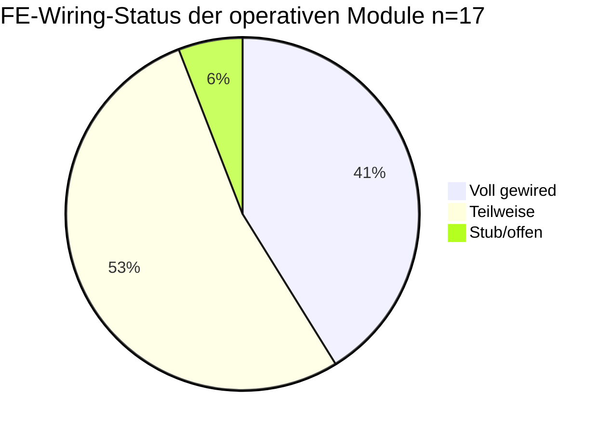
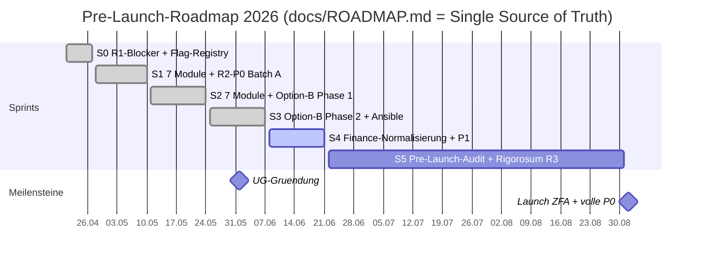
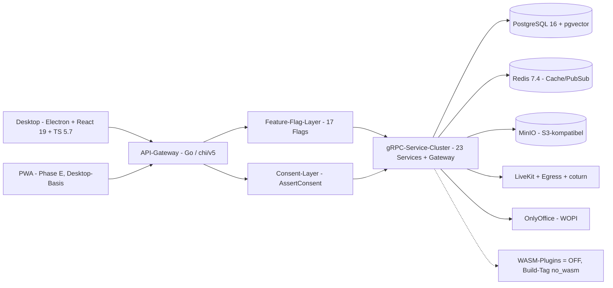
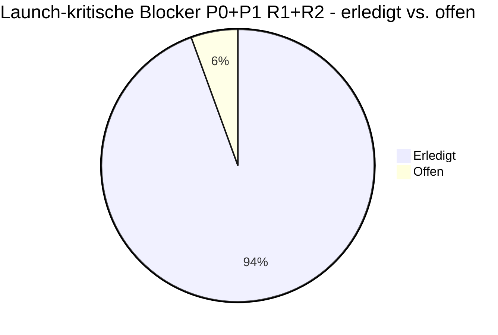
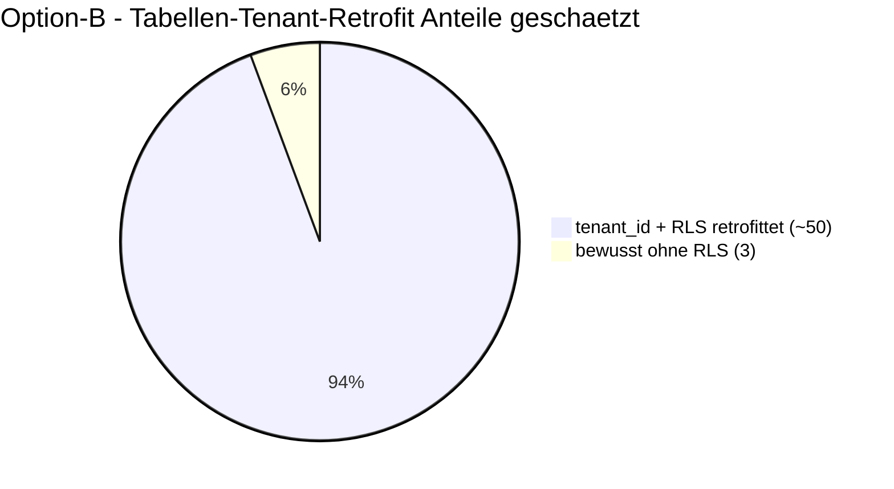
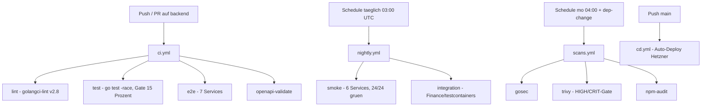
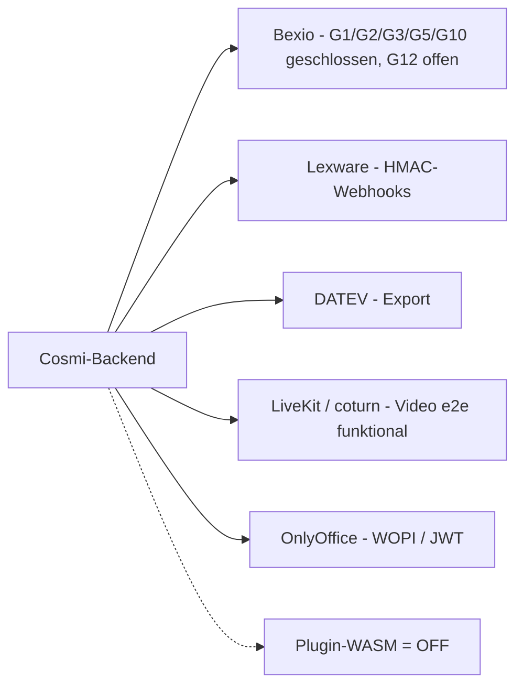
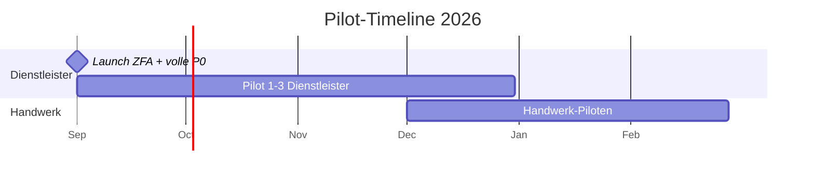

# Projekt-Status-Snapshot — Cosmi/Zentria CRM (Stand: 2026-06-18)

> Deskriptiver Ist-Stand-Snapshot. **Keine** Empfehlungen, keine Priorisierung — reine Lagebeschreibung.
> Bei Konflikt zwischen kuratierter Doku (Stand Mai 2026) und gemessenen Live-Repo-Signalen ist das
> **Live-Signal maßgeblich**; abweichende Doku-Stände sind als „(Doku-Stand …)" mitnotiert.
> Nicht belegbare Werte sind explizit „(geschätzt)" markiert.

## Executive Summary

Cosmi (Software) der **Zentria UG i.G.** ist ein All-in-One-CRM für DACH-KMUs mit EU-Datensouveränität und
befindet sich in der **Pre-Launch-Phase**: **Sprint 4 läuft aktiv** (2026-06-08 – 2026-06-21), Sprint 5
(Pre-Launch-Audit) beginnt in 4 Tagen. Die nächsten Fixpunkte sind **UG-Gründung 2026-06-01** und der
**Launch (ZFA-Pilot-0 + volle P0-Feature-Parität) 2026-09-01**. Die kombinierte
Launch-Reife liegt bei **Note 3.7** (Rigorosum Runde 1 „wild-wren" 3.3 + Runde 2 „functional-seahorse" 4.1);
Rigorosum Runde 3 steht in Sprint 5 aus. **Alle 16 P0-Launch-Blocker (7 aus R1 + 9 aus R2) sind geschlossen**,
zuletzt R2-P0.4 (Recording-Consent-Modal) am 2026-06-05; offen sind noch 2 von 20 P1. Zuletzt live gingen die
**FE↔Backend-Wiring-Wellen** (helpdesk, schichten, hr/zeiterfassung, wiki, rapporte, inventar), die
**Finance-Normalisierung nach ADR-0007**, die **Bexio-Härtung** und **erstmals end-to-end funktionsfähiges
Video**; der Live-Stand des Repos heute: **Migrationskopf 000213**, **24 `backend/cmd/*`-Services** (23 µSvc +
Gateway), **17 Feature-Flags** (alle 14 Modul-Flags default OFF) und `COSMI_ENV=production` seit 2026-06-05
scharf geschaltet.

---

## 1 · Modul-Reifegrad-Matrix

**Legende:** ✅ voll · 🟡 teilweise · ⬜ Stub/offen · Live-Flag = Registry-Default (alle Modul-Flags stehen
default **OFF**, d. h. per Feature-Gate deaktiviert; crm/dialer sind ungaterte Kern-Domänen).

| Modul | Sprint | Backend-RPCs | FE-Wiring (Stand heute) | Live-Flag (Default) | Pilot-Prio |
|---|---|:---:|:---:|---|---|
| crm | Kern | ✅ | ✅ | Kern (ungated) | Cross |
| dialer | Kern | ✅ (Cov 31,8 %) | ✅ | Kern (ungated) | Cross |
| wiki | S1 | ✅ ~14 | ✅ (Welle 1) | `modules.wiki` OFF | Dienstleister |
| berichte | S1 | ✅ ~10 | 🟡 | `modules.berichte` OFF | Dienstleister |
| formulare | S1 | ✅ ~16 | 🟡 | `modules.formulare` OFF | Cross |
| helpdesk | S1 | ✅ ~22 | ✅ (Welle 1: KB/Routing/Stats) | `modules.helpdesk` OFF | Dienstleister |
| vertraege | S1 | ✅ ~14 | 🟡 (Reminder via pg_notify live) | `modules.vertraege` OFF | Dienstleister |
| buchhaltung/finanzen | S1+S4 | ✅ Completion + ADR-0007 normalisiert | 🟡 (Modal-Tiefe Batch A) | `modules.buchhaltung` OFF | Cross |
| video | S1 | ✅ Completion (e2e funktional) | 🟡 | `modules.video` OFF | Cross |
| rapporte | S2 | ✅ ~18 | ✅ (Welle 2, QA grün) | `modules.rapporte` OFF | Handwerk |
| schichten | S2 | ✅ ~16 | ✅ (Welle 1: Wochengitter, SwapRequests) | `modules.schichten` OFF | Handwerk |
| fuhrpark | S2 | ✅ ~18 | 🟡 (Welle 3 offen) | `modules.fuhrpark` OFF | Handwerk |
| vermietung | S2 | ✅ ~20 | ✅ (Welle 1) | `modules.vermietung` OFF | Handwerk |
| inventar | S2 | ✅ ~16 | 🟡 (inline neu gebaut, Push-Gate offen) | `modules.inventar` OFF | Cross |
| einkauf | S2 | ✅ ~18 | 🟡 (Welle 3 offen) | `modules.einkauf` OFF | Cross |
| produktion | S2 | ✅ ~16 | 🟡 (Welle 3 offen) | `modules.produktion` OFF | Handwerk |
| hr/zeiterfassung | — | 🟡 (RPCs gebaut) | ⬜ (zeiterfassung-Stub revertiert, Rebuild deferred) | — | Cross |

> Hinweis zur Modul-Zählung: `docs/MODULES_SCOPE_MATRIX.md` zählt **14 *neue* Module** (wiki … produktion).
> Diese Matrix zeigt zusätzlich die Kern-Domänen **crm/dialer** und **hr/zeiterfassung**, weil der Snapshot
> die operativen Module abbildet. RPC-Zahlen mit „~" sind geplante Werte aus der Scope-Matrix (geschätzt).

*Caption: Die Backend-RPCs sind über alle 14 Fachmodule in den Sprints 1+2 gebaut (durchgängig ✅); der
aktuelle Reife-Engpass liegt im **FE↔Backend-Wiring** (store→API), das in drei Wellen läuft — 7 Module voll
gewired, 9 teilweise, hr/zeiterfassung als einziger reiner Stub (Rebuild zurückgestellt).*

---

## 2 · Roadmap — 6 Sprints bis Launch

*Caption: Sprint 0–3 sind abgeschlossen, **Sprint 4 ist aktiv** (heute 2026-06-18, Tag 11/14), Sprint 5
folgt direkt. Der Launch wurde von 01.07 auf **2026-09-01** verschoben; Pilot-0 (ZFA) und volle
P0-Feature-Parität (E-Rechnung/GoBD/DATEV/Bexio) fallen damit auf einen Launch-Termin zusammen.*

---

## 3 · Architektur-Überblick

*Caption: Thin-Client (Electron/React, PWA) → zentraler Go-API-Gateway (chi/v5) mit vorgelagertem
Feature-Flag- und Consent-Layer → 23 gRPC-Microservices → PostgreSQL 16 als einzige Source-of-Truth
(Redis nur Cache, kein Dual-Write). Video/Audio läuft über self-hosted LiveKit + coturn (EU); das
**WASM-Plugin-System ist deaktiviert** (Flag `plugins.wasm` OFF + Build-Tag `no_wasm`) — gestrichelte Kante.*

---

## 4 · Launch-Reife & Blocker-Burndown

**Kombinierte Launch-Reife: Note 3.7** — aus Rigorosum Runde 1 („wild-wren", 3.3) und Runde 2
(„functional-seahorse", 4.1). Schlechteste Einzelzone: Realtime-Kern 4.5 (R2). Rigorosum Runde 3
(Ziel-Note ≥ 2,3) ist für Sprint 5 geplant.

| Prio | R1 | R2 | Gesamt | Erledigt | Offen |
|---|:---:|:---:|:---:|:---:|---|
| P0 | 7 | 9 | 16 | **16** | 0 |
| P1 | 8 | 12 | 20 | **18** | 2 (R2-P1.10 Partitionierung, R2-P1.12 Finance*) |
| P2 | 7 | 15 | 22 | teils | Rest in Follow-up-Docs getrackt (geschätzt) |
| P3 | 9 | 6 | 15 | teils | Rest deferred (geschätzt) |

> *R2-P1.12 (Finance-Normalisierung) ist laut ADR-0007-Implementierungsnotiz (Migr. 000132/133) **erledigt**,
> in der ROADMAP-P1-Tabelle aber noch als „Pending" gelistet — **Doku-Widerspruch**, Tabelle nicht
> nachgezogen. R2-P1.10 (Partitionierung) ist offen, weil das pgvector-Image kein `pg_cron` mitbringt.

*Caption: Die 16 P0- und 20 P1-Befunde aus beiden Rigorosum-Runden sind zu 34/36 abgearbeitet; offen sind
nur zwei P1. P2/P3 sind teils erledigt, teils bewusst in Follow-up-Dokumenten zurückgestellt (exakte
Erledigt-Quote für P2/P3 nicht durchgängig getrackt — geschätzt).*

---

## 5 · Multi-Tenancy / RLS-Retrofit (Option-B-Full)

Modell: Single-Tenant-Code, aber **alle Tabellen erhalten `tenant_id UUID NOT NULL`** + Row-Level-Security
(Architektur-Regel 11). Retrofit lief in Sprint 2+3 (Migrations 000104–000115) über ~50 Tabellen; die
RLS-Foundation ist seit Migration 119 live. Drei Tabellen bleiben **bewusst ohne RLS** (`schema_migrations`,
`caldav_settings`, `industry_templates`, ADR-006). Production-DB nutzt seit Migr. 121 zwei Rollen:
`kmuhub` (Superuser, nur DDL) + `kmuhub_app` (NOSUPERUSER NOBYPASSRLS, App-Services).

*Caption: Der Tenant-Retrofit über ~50 Tabellen ist abgeschlossen; `COSMI_ENV=production` ist **seit
2026-06-05 scharf** (RLS produktiv erzwungen). Aktueller **Migrationskopf live: 000213** (182 `.up.sql`-
Dateien insgesamt; Nummern-Lücken wie 150–159 sind reservierte Wellen-Blöcke). Die „~50" ist eine
Größenangabe aus der Doku (geschätzt).*

---

## 6 · Qualität & CI/CD

**CI-Pipeline-Split** (seit 2026-06-09): per-push schlank, schwere Jobs in Schedule-Workflows ausgelagert.
Coverage-Gate **15 %** CI-enforced (real ~20 % nach Proto-Code-Filter — geschätzt aus Code-Kommentar).
Letzter belegter Prod-Stand: **Smoke 24/24 grün** (seit 2026-06-05), `COSMI_ENV=production` scharf, Video
erstmals e2e funktional.

| Workflow | Trigger | Jobs |
|---|---|---|
| `ci.yml` | push/PR auf `backend/**` | lint (golangci-lint v2.8) · test (`-race` + 15 %-Gate) · e2e (7 Svc) · openapi-validate |
| `ci-desktop.yml` | Desktop-Änderungen | Lint / Typecheck (separater Workflow — eigene grün/rot-Prüfung) |
| `nightly.yml` | täglich 03:00 UTC + dispatch | smoke (6 Svc) · integration (Finance, testcontainers) |
| `scans.yml` | mo 04:00 UTC + dep-change + dispatch | gosec · trivy (HIGH/CRIT-Gate) · npm-audit |
| `cd.yml` | push main | Auto-Deploy Hetzner |
| `claude-pr.yml`, `security-review.yml` | PR/dispatch | Review-Automation |

*Caption: Per-Push laufen nur die schnellen Gates (lint/test/e2e/openapi); Smoke und Integration nightly,
die Security-Scans wöchentlich bzw. bei Dependency-Änderungen. Desktop-CI ist ein eigener Workflow und
muss separat auf grün geprüft werden.*

---

## 7 · Integrationen-Landkarte (Extra)

*Caption: Buchhaltungs-Anbindungen (Bexio/Lexware/DATEV) und Kollaboration (LiveKit, OnlyOffice) sind
verdrahtet; bei Bexio sind fünf Gaps (G1/G2/G3/G5/G10) geschlossen, **G12** (bidirektionaler Invoice-Pull) ist
eine offene Produkt-Entscheidung. Die WASM-Plugin-Schnittstelle bleibt deaktiviert (gestrichelt).*

---

## 8 · Pilot-Timeline (Extra)

*Caption: Der Rollout startet mit dem ZFA-Pilot-0 am 2026-09-01 (gleichzeitig volle P0-Parität / Finance-Wellen),
gefolgt von Dienstleister-Piloten bis Dezember; Handwerk-Piloten beginnen ab Dezember/Januar.*

---

## Datenbasis & Annahmen

**Gelesene Quellen (Reihenfolge der Vorgabe):**
`README.md` · `docs/ROADMAP.md` (Single Source of Truth, Stand 2026-06-11) ·
`docs/MODULES_SCOPE_MATRIX.md` (Stand 2026-05-10) · `docs/ARCHITECTURE.md` (ADR-001…006) +
`docs/adr/0007-finance-line-items-normalization.md` · `.knowledge/_index.md` (Stand 2026-05-10) ·
`.knowledge/milestones.md` (Stand 2026-06-12) · `CLAUDE.md` · Auto-Memory-Index `MEMORY.md`.

**Live gemessene Repo-Signale (2026-06-18):**
- Migrationskopf **000213** (`000213_hr_company_settings_work_hours.up.sql`), **182** `.up.sql`-Dateien.
- **24** Verzeichnisse unter `backend/cmd/*` (23 Microservices + `gateway`).
- **17** Feature-Flags in `backend/internal/featureflag/registry.go` (14× `modules.*` OFF, `plugins.config` ON,
  `plugins.wasm` OFF, `plugins.api` OFF).
- Coverage-Gate **15 %** in `.github/workflows/ci.yml`.
- Letzte Commits: API-Doku, i18n-Mojibake-Fix, FE↔Backend-Wiring (helpdesk/schichten/hr/wiki).

**Als „(geschätzt)" markierte Werte:**
- RPC-Zahlen je Modul (`~14`, `~22`, …) — geplante Werte aus der Scope-Matrix, keine Code-Zählung.
- Reale Test-Coverage „~20 %" — aus einem Code-Kommentar, nicht frisch gemessen.
- P2/P3-Erledigt-Quoten — nicht durchgängig getrackt.
- „~50 retrofittete Tabellen" — Größenangabe aus der Doku.

**Benannte Doku-vs-Live-Diskrepanzen:**
1. **Migrationskopf:** Live **000213** vs. Doku 115 (README) / 116 (Matrix) / 131 (milestones) / 133 (ADR) —
   die kuratierten Docs sind veraltet, der gemessene Live-Wert ist maßgeblich.
2. **Service-Zahl:** Live **24** `cmd`-Dirs (23 + Gateway) vs. „25 App-Services" (README, zählt zusätzliche
   Compose-Dienste) vs. „24 gRPC-Microservices" (CLAUDE.md).
3. **Feature-Flags:** Live **17** vs. Doku „16" — `plugins.api` ist neu hinzugekommen.
4. **R2-P1.12 (Finance):** ADR sagt erledigt, ROADMAP-Tabelle sagt „Pending" — Tabelle nicht nachgezogen.
5. **`.knowledge/_index.md`** (Stand 2026-05-10) ist ggü. `milestones.md` (2026-06-12) ~5 Wochen veraltet;
   Sprint-4-Ereignisse (alle P0 dicht, `COSMI_ENV=production` scharf, Finance-Normalisierung) fehlen dort.
6. **ADR-0007** liegt nicht in `docs/ARCHITECTURE.md` (nur ADR-001…006), sondern separat unter `docs/adr/`.

*Snapshot erstellt 2026-06-18 · Modell-Stand: Daten aus Phase-1-Exploration (Explore-Subagenten) +
direkter Repo-Messung; deskriptiv, ohne Bewertung oder Empfehlung.*
